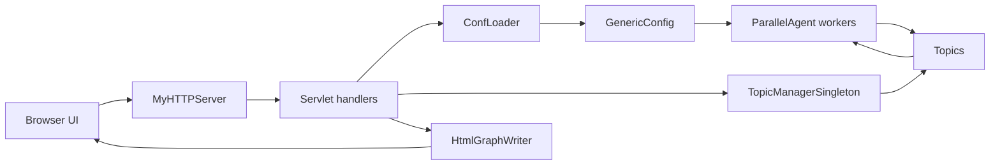
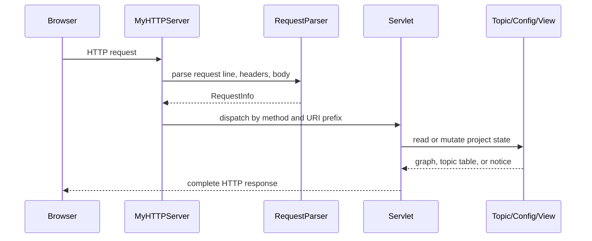
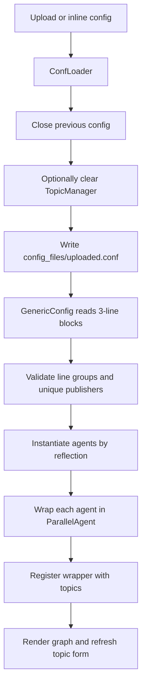
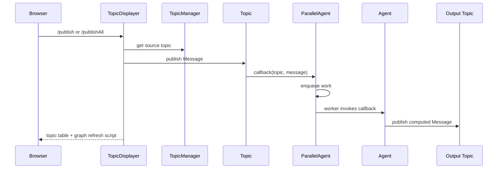

# Avi Sinai's Computational Graph Project

A plain-Java browser console for deploying, visualizing, and running topic-based computational graphs at runtime.

This project is interesting because it combines a custom multithreaded HTTP server, publish/subscribe messaging, reflection-based agent loading, active-object concurrency, and SVG graph visualization without relying on a web framework or build system. Users can upload or write a graph configuration, publish values to source topics, and watch arithmetic or Boolean agents propagate messages through the graph.

Built with Java 21, sockets, threads, reflection, HTML, CSS, JavaScript, and generated SVG.

---

## Features

- [x] Custom multithreaded HTTP server
- [x] Servlet-style route dispatch
- [x] Publish/subscribe topic architecture
- [x] Active Object concurrency through `ParallelAgent`
- [x] Reflection-based plugin loading
- [x] Runtime graph deployment from config files
- [x] Inline browser config editor
- [x] Dynamic graph editing: add agents, add legal edges, remove topics, remove agents, remove edges
- [x] One-click graph reset that closes the active config and clears topics
- [x] Runtime topic publishing
- [x] Bulk source-topic publishing
- [x] Multi-output agents
- [x] Variable-input arithmetic and Boolean agents
- [x] Boolean and arithmetic agent library
- [x] Branded browser UI for Avi Sinai's Computational Graph Project
- [x] Duplicate publisher validation
- [x] Computed-topic overwrite protection
- [x] Cycle detection for graph layout
- [x] SVG graph visualization with edge value labels
- [x] Browser-based three-panel UI
- [x] Bounded `ParallelAgent` shutdown under full queues
- [x] Integration-style edge-case test suite

---

## Demo

Screenshots and a demo GIF can be added under `docs/images`. A good demo flow is: open `http://localhost:8080/app/index.html`, deploy `config_files/two_stage_pipeline.conf`, publish `A=4` and `B=6`, then show `C=10.0` and `D=11.0` in both the topic table and graph edge labels.

---

## Architecture



The application has four runtime layers:

- HTTP layer: accepts sockets, parses requests, dispatches to servlets.
- Configuration layer: loads agent classes and owns the active deployed graph.
- Messaging layer: stores topics, messages, publishers, and subscribers.
- View layer: derives graph nodes from topics and renders HTML/SVG for the browser.

Editable Mermaid diagrams live in [docs/diagrams](docs/diagrams).

### Request Lifecycle



### Configuration Loading



### Publish Flow



---

## Project Structure

```text
assignment6-project/
  README.md                  # Human-facing project overview
  docs/
    diagrams/                # Editable Mermaid architecture diagrams
    images/                  # Placeholder location for screenshots/GIFs
  config_files/
    README.md                # Fixture descriptions
    *.conf                   # Valid and invalid sample graph configs
  html_files/
    index.html               # Three-panel browser shell
    form.html                # Config, graph editing, and publish controls
    graph.html               # SVG graph template
    temp.html                # Branded empty-state frame
  src/
    Main.java                # Application bootstrap and route registration
    configs/                 # Config loaders and arithmetic/Boolean agents
    graph/                   # Message, topic, agent, graph, and concurrency model
    server/                  # Custom HTTP server and request parser
    servlets/                # Route handlers for UI, config, graph, and topics
    tests/                   # Visible edge-case integration test
    views/                   # HTML/SVG graph rendering
```

Package responsibilities:

- `graph`: domain primitives and graph reconstruction.
- `configs`: loadable agent implementations and config lifecycle.
- `server`: socket accept loop, request parsing, and route lookup.
- `servlets`: browser-facing HTTP behavior.
- `views`: visual representation of the current graph.

---

## Design Patterns

### Singleton

`TopicManagerSingleton` centralizes topic ownership so agents, servlets, and graph rendering all observe the same runtime graph. The tradeoff is global mutable state: simple for a local console, but not suitable for isolated multi-user sessions.

### Observer / Publish-Subscribe

`Topic` is the subject and `Agent` instances are observers. This fits the project because computations are triggered by message flow rather than by a central scheduler. The tradeoff is that feedback cycles need explicit protection if the project evolves toward production use.

### Decorator / Active Object

`ParallelAgent` wraps a normal `Agent`, preserves the same public interface, and moves callback execution onto a dedicated worker thread. This keeps individual agent state serialized while decoupling topic publication from computation. The tradeoff is one thread per configured agent and the need for careful shutdown.

### Reflection-Based Plugin Loading

`GenericConfig` loads agent classes by name using a stable `(String[] subs, String[] pubs)` constructor contract. This makes new agents easy to add without changing the loader. The tradeoff is weaker compile-time safety and the need for clear validation errors.

### Template Rendering

`HtmlGraphWriter` generates SVG and injects it into `html_files/graph.html`. This keeps the graph algorithm in Java while allowing the page chrome and CSS to remain editable HTML.

---

## Configuration

Generic config files are groups of three non-empty lines:

```text
fully.qualified.AgentClass
inputTopic1,inputTopic2
outputTopic1,outputTopic2
```

Example:

```text
configs.PlusAgent
A,B
C
configs.IncAgent
C
D
```

Publish:

```text
A = 4
B = 6
```

Expected output:

```text
C = 10.0
D = 11.0
```

Math agents:

- `PlusAgent`, `IncAgent`, `SubAgent`, `MulAgent`, `DivAgent`, `ModAgent`, `PowAgent`, `MinAgent`, `MaxAgent`, `AvgAgent`

Boolean agents:

- `AndAgent`, `OrAgent`, `XorAgent`, `NandAgent`, `NorAgent`, `XnorAgent`, `MajorityAgent`, `NotAgent`, `BufAgent`

Boolean inputs accept `1`, `0`, `true`, `false`, `t`, `f`, `yes`, `no`, `on`, and `off`.

---

## Browser Interface

Open `http://localhost:8080/app/index.html`.

The browser title and top header identify the app as **Avi Sinai's Computational Graph Project**.

- Left panel: upload configs, write inline configs, append raw config blocks, add prebuilt agents, add/remove graph edges, remove topics or agents, reset the graph, and publish topic values.
- Center panel: generated SVG computational graph.
- Right panel: current topic table and warnings.

Computed topics are hidden from manual publishing so a browser publish cannot overwrite configured outputs.
The add-edge form validates that at least one endpoint is an existing agent, rejects duplicates, and only allows extra input edges for variable-input agents.
The reset action closes the active config, clears all topics, and returns the graph panel to its empty state.

---

## HTTP Routes

The project uses a small servlet-style router over a custom socket server:

- `GET /app/`: static HTML loader rooted at `html_files`.
- `GET /publish`: publish one topic value and render the topic table.
- `GET /publishAll`: publish multiple source-topic values from the generated bulk form.
- `GET /topic-form`: render the current source-topic publish form.
- `GET /graph`: render the current SVG graph.
- `POST /upload`: deploy an uploaded config file.
- `POST /create-config`: deploy inline config text.
- `POST /append-config`: append a raw config block to the active config.
- `POST /edit-config`: add/remove legal config edges, remove topics, or remove agents.
- `POST /reset-config`: close the active config and clear all topics.

---

## Build, Run, Test

Compile:

```powershell
javac -d out src\graph\*.java src\configs\*.java src\server\*.java src\servlets\*.java src\views\*.java src\Main.java src\tests\Assignment6EdgeCaseTest.java
```

Run:

```powershell
java -cp out Main
```

Open:

```text
http://localhost:8080/app/index.html
```

Press Enter in the terminal running `Main` to stop the server.

Test:

```powershell
java -cp out tests.Assignment6EdgeCaseTest
```

Expected result:

```text
RESULT: PASSED 53 / 53 checks.
```

---

## Screenshots To Add

- `docs/images/main-ui.png`: empty console after first load.
- `docs/images/graph-example.png`: `two_stage_pipeline.conf` deployed.
- `docs/images/boolean-demo.png`: `boolean_gates.conf` deployed.
- `docs/images/topic-table.png`: topic values after publishing.
- `docs/images/config-editor.png`: inline config editor and prebuilt agent builder.
- `docs/images/demo.gif`: short end-to-end interaction.

---

## Known Limitations

- The HTTP implementation is educational and intentionally minimal.
- Request bodies are currently parsed through character streams, which is not robust for arbitrary binary multipart uploads.
- The graph is global process state; there are no isolated user sessions.
- Cyclic graphs are detected for visualization but not guarded during execution.
- Publish completion uses a short sleep rather than deterministic worker acknowledgements.
- Closing a `ParallelAgent` now clears queued callbacks to guarantee bounded shutdown, so callbacks accepted before close are not guaranteed to run during shutdown.
- Dynamic config editing is text-based under the hood, so validation is intentionally conservative.
- There is no authentication, persistence layer, TLS, or production logging.

---

## Future Work

- WebSocket or server-sent-event live updates.
- JSON REST API for configs, topics, graph structure, and metrics.
- Graph persistence with named saved configurations.
- User authentication and per-session graph isolation.
- Plugin marketplace or registry for loadable agents.
- Performance dashboard with request counts, active threads, queue sizes, and publish latency.
- Graph search, filtering, and node highlighting.
- SVG/PNG graph export.
- Config validation page with cycle warnings and duplicate-output diagnostics.
- Deterministic publish completion without sleeps.
- Structured HTTP response and multipart parsing helpers.
- Concurrency stress tests.

---

## Credits

Developed as an advanced Java assignment project and extended with runtime editing, richer visualization, additional agent families, validation, and browser-console features.
